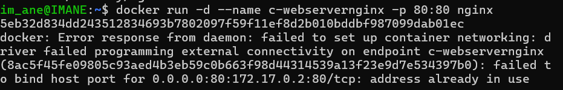
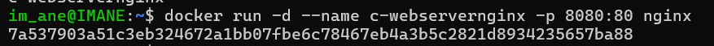
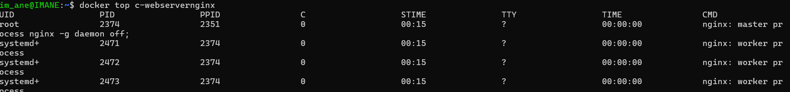
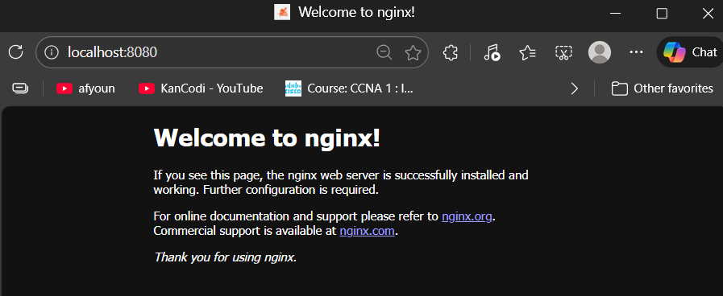

# Nginx with Docker: A Beginner’s Guide

---

## **1. What is Nginx?**
Nginx is a popular **web server** and **reverse proxy server**. It’s used to serve web pages, handle HTTP requests, and improve the performance of web applications.

### **Why Use Nginx with Docker?**
- **Isolation**: Docker allows you to run Nginx in a container, keeping it isolated from other applications on your machine.
- **Portability**: You can easily move the container to different environments (e.g., development, production).
- **Simplicity**: Docker simplifies the setup and management of Nginx.

---
## Lab2: Basic Container Operations with Nginx
### Overview
In this lab, you are required to follow the steps below to perform basic container operations using Nginx:

**Steps Required:**

-> Pull/Download the Nginx Image  
-> Pull the official Nginx image from Docker Hub.  


-> Create and Start the Nginx Container  
-> Create and start an Nginx container with the following  **conditions:**

-> The container name should be nginxwebserver.
-> The container should start in detached mode.
-> Use port mapping (8080:80):

Port 8080 on your local system should be mapped to Nginx port 80.


-> Verify the Container is Running
-> Verify that the container is running by filtering all running containers by the name nginxwebserver.


-> Access Nginx in Your Browser
-> Open a browser and visit http://localhost:8080 to see if the Nginx server is up and running.


-> List Processes Running in the Container


-> Stop the running container.


-> Verify the Container Has Stopped
Verify that the container has stopped by listing all containers, including stopped ones.
---

## **2. Why Port 80 or 8080?**
- **Port 80**: The default port for HTTP traffic. When you visit a website like `http://example.com`, your browser connects to port 80.
- **Port 8080**: An alternative port for HTTP traffic. Often used when port 80 is already in use by another service (e.g., Apache, another Nginx container).

---

## **3. Why Run Nginx in Detached Mode?**
- **Detached Mode (`-d`)** runs the container in the background, freeing up your terminal for other tasks.
- Use detached mode for **long-running services** like web servers, databases, or APIs.
- You can still interact with the container using `docker logs` or `docker exec`.

---

## **4. What to Do If Port 80 Doesn’t Work?**
If port 80 is already in use, you’ll see an error like:
```
Error response from daemon: failed to set up container networking: driver failed programming external connectivity on endpoint <container_name>: address already in use.
```

### **Solutions:**
When you tried to run an Nginx container on **port 80**, you might have encountered an error because port 80 was already in use by another service (like Apache or another Nginx container).

Even though the container failed to start, Docker still **created the container** with the name `c-webservernginx`. This means you need to **delete the failed container** before creating a new one.

1. **Use a Different Port (e.g., 8080)**:
   ```bash
   docker run -d --name my-nginx -p 8080:80 nginx
   ```
   - Access Nginx at: [http://localhost:8080](http://localhost:8080)

2. **Stop the Service Using Port 80**:
   - Find the service using port 80:
     ```bash
     sudo lsof -i :80
     ```
   - Stop the service (e.g., Apache):
     ```bash
     sudo systemctl stop apache2
     ```
   - Then run Nginx on port 80:
     ```bash
     docker run -d --name my-nginx -p 80:80 nginx
     ```

---

## **5. Commands to Use**

### **Pull the Nginx Image from Docker hub**
```bash
docker pull nginx
```

### **Run Nginx in Detached Mode**
```bash
docker run -d --name my-nginx(container's name) -p 8080:80 nginx(image)
```


### **Check Running Containers**
```bash
docker ps
```

### **View Container Logs**
```bash
docker logs my-nginx
```
### **List Processes Running in the Container**

### **Access Nginx in Your Browser**
Open your browser and go to:
- [http://localhost:8080](http://localhost:8080) (if using port 8080)
- [http://localhost](http://localhost) (if using port 80)


### **Stop the Container**
`If the container is stopped, it won’t appear in the list. Use docker ps -a to see all containers, including stopped ones.`  
```bash
docker stop my-nginx
```

### **Remove the Container**
```bash
docker rm my-nginx
```

---

## **6. Troubleshooting Tips**
- **Port Conflict**: If you see a port conflict error, use a different port (e.g., 8080) or stop the service using port 80.
- **Container Already Exists**: If you get an error that the container name is already in use, remove the existing container first:
  ```bash
  docker rm my-nginx
  ```

---

## **7. Example Workflow**

### **Step 1: Run Nginx on Port 8080**
```bash
docker run -d --name my-nginx -p 8080:80 nginx
```

### **Step 2: Verify the Container Is Running**
```bash
docker ps
```

### **Step 3: Open Nginx in Your Browser**
Go to [http://localhost:8080](http://localhost:8080).

---


---

### **Key Points for You:**
- Use **port 80** if it’s free (default for web servers).
- Use **port 8080** if port 80 is already in use.
- Run Nginx in **detached mode** (`-d`) for long-running services.
- If you encounter errors, check for port conflicts or existing containers.