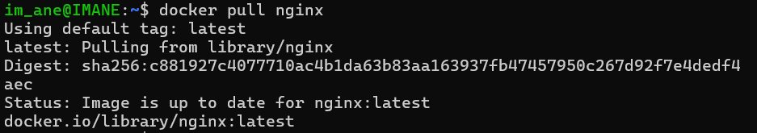
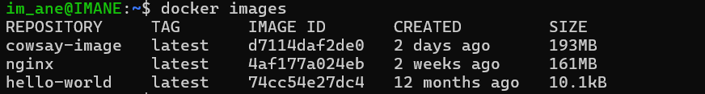
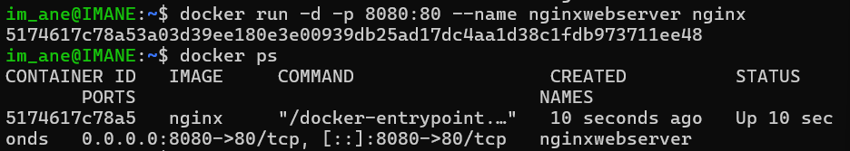
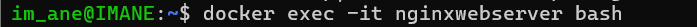
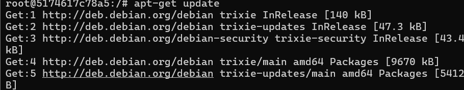
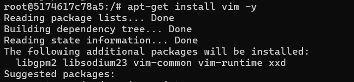
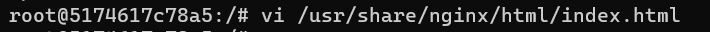
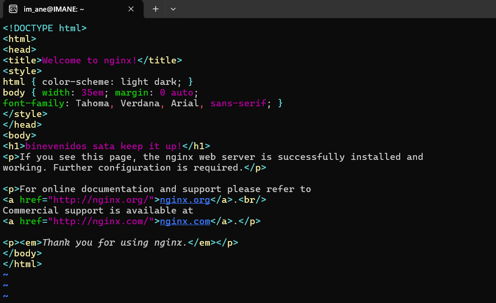
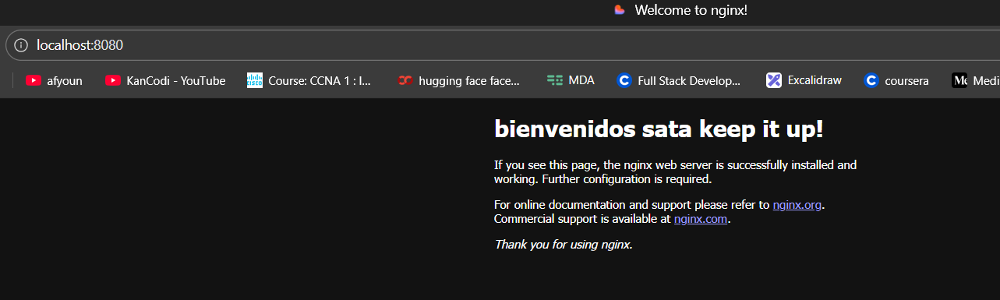

### **Lab: Live Container Modification**

#### **Overview**
In this lab, you will modify a running Nginx container in real-time. Here’s what you’ll do:
- Start an Nginx container in detached mode.
- Open an interactive session inside the running container.
- Modify the `index.html` file inside the container.
- Verify the changes in your browser immediately.

---

### **Steps Required:**

#### **Step 1: Pull the Nginx Image**
- You need the Nginx image to create a container. If you don’t have it locally, Docker will pull it from Docker Hub.  
- Pull the Nginx web server image from Docker Hub if you don’t already have it.
  ```plaintext
  Image name: nginx
  ```
  
  

#### **Step 2: Create and Start the Nginx Container**
- You create a container named `nginxwebserver` and run it in detached mode so it runs in the background.
- Port 8080 on your machine is mapped to port 80 on the container, allowing you to access the Nginx server via your browser.  

  ```plaintext
  Container name: nginxwebserver
  Port mapping: 8080:80
  ```
  

#### **Step 3: Access Nginx Server in Browser**
- By visiting `http://localhost:8080`, you can see the default Nginx welcome page, confirming that the container is running correctly.  
- Open your web browser and visit `http://localhost:8080` to see the default Nginx welcome page.

#### **Step 4: Open an Interactive Bash Shell Session**
- You use `docker exec` to open a bash shell inside the running container. This allows you to run commands inside the container.  
- Open an interactive bash shell session inside the running container.
  ```plaintext
  Command: docker exec -it nginxwebserver /bin/bash
  ```

#### **Step 5: Update Package Lists**
- Updating the package list ensures you have the latest package information.
- Installing `vim` allows you to edit files within the container easily.  
- Once inside the container, update the package lists using the command:
  ```plaintext
  Command: apt-get update
  ```
    

- Install the `vim` text editor (to edit files easily):
  ```plaintext
  Command: apt-get install vim -y
  ```
  

#### **Step 6: Edit the `index.html` File**
- The `index.html` file is the default webpage served by Nginx. By editing this file, you change what is displayed in the browser.
- You use `vim` to edit the file and update the welcome message.  

- Navigate to the directory where the `index.html` file is located:
  ```plaintext
  File path: /usr/share/nginx/html/index.html
  ```
- Edit the file using `vim` and change the welcome message from "Welcome to nginx!" to "Welcome to My Cool nginx!".
  ```plaintext
  Command: vim /usr/share/nginx/html/index.html
  ```
- In `vim`, press `i` to enter insert mode, make your changes, then press `Esc`, type `:wq`, and press `Enter` to save and exit.



#### **Step 7: Verify Changes in Browser**
- Refreshing the browser shows the updated message, confirming that your changes inside the container are reflected in real-time.  
- Refresh your browser at `http://localhost:8080` to see if the updated message appears.


---
