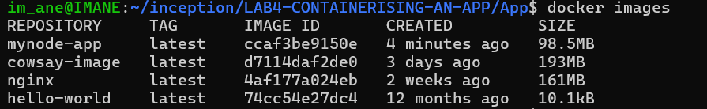
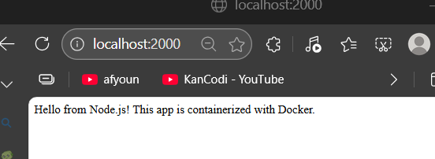

### Why Containerize Your App?
if you want anyone to easily run your app on their laptop (or any machine) without worrying about dependencies, configurations, or environment differences, containerizing it with Docker is a great solution.

### What Happens When You Containerize?


#### Dockerfile:

You create a `Dockerfile` that describes how to build your app inside a container.
The `Dockerfile` copies your app files (like app.js) from your local machine into the container.
It installs all necessary dependencies (like Node.js, npm packages, etc.) inside the container.


**Building the Image:**

When you run docker build, Docker creates an image of your app with all its dependencies.
This image is like a snapshot of your app and its environment.


**Running the Container:**

When someone runs docker run, Docker starts a container from that image.
The container runs your app in an isolated environment, just like it would on your machine.


`Output:`

The app runs inside the container, and users can interact with it (e.g., see the output in their browser or terminal).


What Happens When You Close Your Laptop?


`Stopping the Container:`

If you simply close your laptop or shut it down, the container stops running, but it is not deleted.
The container and its state (like logs or temporary files) still exist on the machine.
---
Here’s a clear, step-by-step **README.md** file you can share with **Momoen** to explain how to containerize and run your app. I’ve structured it to be easy to follow, with one step at a time, as you prefer:

---

# Containerizing a Node.js App: Step-by-Step Guide

---

## **Overview**
This guide explains how to containerize a Node.js app using Docker. By following these steps, anyone can run your app on their machine without worrying about dependencies or configurations.

---

## **Project Structure**
Your project folder should contain the following files:
```
App/
├── Dockerfile    # Docker configuration file
├── app.js        # Main application file
└── package.json  # Project metadata and dependencies
```

---

## **Step 1: Build the Docker Image**

1. Open a terminal.
2. Navigate to the folder containing your `Dockerfile`, `app.js`, and `package.json`:
   ```bash
   cd ~/inception/LAB4-CONTAINERISING-AN-APP/App
   ```
3. Build the Docker image:
   ```bash
   docker build -t mynode-app .
   ```
   - `-t mynode-app` tags the image with the name `mynode-app`.
   - `.` tells Docker to use the current directory as the build context.


---

## **Step 2: Verify the Image**
Check that the image was created successfully:
```bash
docker images
```
You should see `mynode-app` listed among the images.


---

## **Step 3: Run the Container**

1. Start a container from the image:
   ```bash
   docker run -d --name mynode-app-container -p 2000:3000 mynode-app
   ```
   - `-d` runs the container in detached mode (in the background).
   - `--name mynode-app-container` gives the container a name.
   - `-p 2000:3000` maps port 2000 on your machine to port 3000 in the container.  


---

## **Step 4: Verify the Container is Running**
Check that the container is running:
```bash
docker ps
```
You should see `mynode-app-container` listed with the status `Up`.  


---

## **Step 5: Access Your App**
Open your browser and go to:
```
http://localhost:2000
```
You should see your Node.js app running.  


---

## **Step 6: Stop the Container (When Done)**
To stop the container:
```bash
docker stop mynode-app-container
```

---

## **Step 7: Delete the Container (Optional)**
If you no longer need the container, delete it:
```bash
docker rm mynode-app-container
```

---

## **Step 8: Delete the Image (Optional)**
If you no longer need the image, delete it:
```bash
docker rmi mynode-app
```

---
## Step 9: Check Container Logs
  

Docker shows you the logs (output) from the container named mynode-app-container.  

is a message printed by your Node.js app (from app.js). Here’s what it means:  
```bash
App running on http://localhost:3000
```
Your Node.js app is running inside the container.  
It is listening for requests on port 3000 inside the container.  
nside the container, your app is running on port 3000.
However, when you ran the container, you mapped port 3000 inside the container to port 2000 on your machine:
```bash
docker run -d --name mynode-app-container -p 2000:3000 mynode-app
```


## **Explanation of Key Concepts**

### **Dockerfile**
The `Dockerfile` contains instructions to build the Docker image:
- `FROM alpine:latest`: Uses a lightweight Alpine Linux base image.
- `RUN apk update && apk add nodejs npm`: Installs Node.js and npm.
- `WORKDIR /usr/app`: Sets the working directory inside the container.
- `COPY . /usr/app`: Copies your app files into the container.
- `RUN npm install`: Installs your app's dependencies.
- `CMD ["node", "app.js"]`: Runs your app when the container starts.

---

## **Why Containerize?**
- **Consistency**: Your app runs the same way on any machine.
- **Isolation**: Dependencies and configurations are encapsulated within the container.
- **Portability**: Easily share and deploy your app.

---

## **Troubleshooting**
- **Port Conflict**: If port 2000 is already in use, change the host port (e.g., `-p 3000:3000`).
- **Container Already Exists**: If you get an error that the container name is already in use, remove the existing container first:
  ```bash
  docker rm mynode-app-container
  ```

---

## **Notes**
- The container will stop if you shut down your machine, but it won’t be deleted unless you explicitly remove it.
- The Docker image will remain on your machine until you delete it.

---

