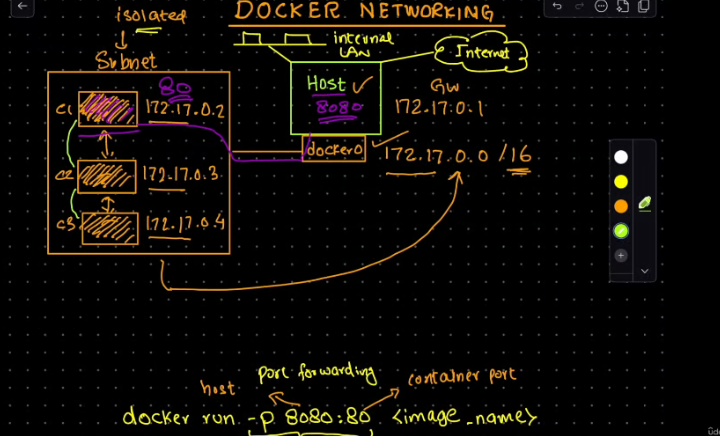
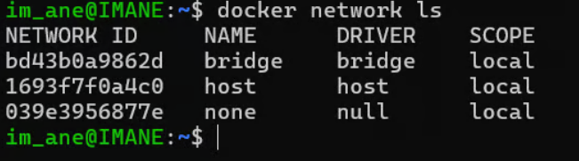
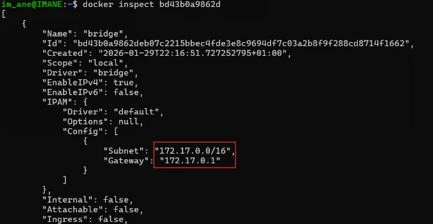
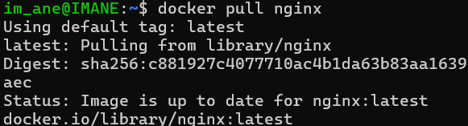
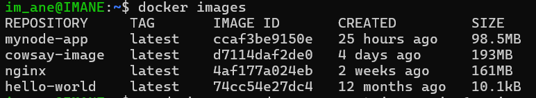
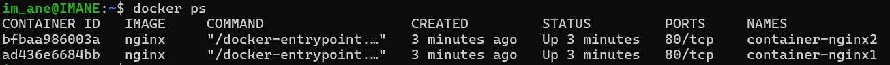
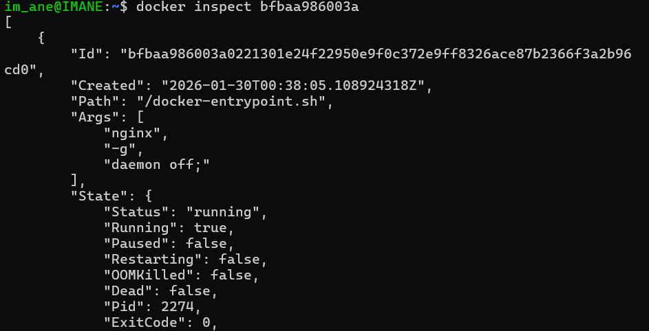
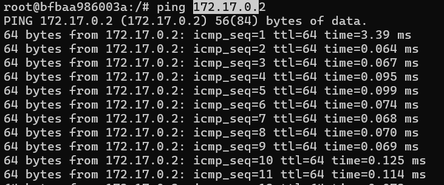

# Docker Networking: Container Communication


---

## **Introduction**
This guide explains how Docker networking works, focusing on the default bridge network. You'll learn how to create two containers from the same image, install the `ping` utility, and test communication between them.

---

## **Basic Concepts**

### **1. Default Bridge Network**
- When you run a Docker container without specifying a network, Docker places it on the default `bridge` network (also known as `docker0`).
- **IP Address Range**: `172.17.0.0/16`.
  - Containers on this network get IP addresses like `172.17.0.2`, `172.17.0.3`, etc.
  - The IP address `172.17.0.1` is reserved for the `docker0` bridge, which acts as a gateway for container traffic.
  
  

### **2. Network Isolation**
- Containers on the default bridge network are isolated from external systems by default.
- They can communicate with each other because they are on the same subnet.

### **3. Port Forwarding**
- To allow external access to a service running inside a container, you map a container port to a host port.
- Example: `-p 8080:80` maps port 80 of the container to port 8080 on the host.

---

## **Steps to Test Communication Between Two Containers**

### **Step 1: Pull the Nginx Image**
Ensure you have the Nginx image:
```bash
docker pull nginx
```




---

### **Step 2: Run Two Nginx Containers**
1. Run the first container in detached mode:
   ```bash
   docker run -d --name nginx1 nginx
   ```

2. Run the second container in detached mode:
   ```bash
   docker run -d --name nginx2 nginx
   ```


---

### **Step 3: Find the IP Addresses of the Containers**
1. list the containers:
    

2. Get the IP address of ` container-nginx2`:

   ```bash
   docker inspect bfbaa986003a
   ```

---

### **Step 4: Install `ping` and Test Communication**
1. Access `nginx1` in interactive mode:
   ```bash
   docker exec -it bfbaa986003a /bin/bash
   ```

2. Install the `ping` utility inside the container:
   ```bash
   apt-get update && apt-get install -y iputils-ping
   ```

3. Test communication with `container-nginx1`:
   ```bash
   ping 172.17.0.2
   ```
   - You should see responses from `nginx1`, confirming that the containers can communicate.

---

### **Step 5: Exit the Container**
1. Exit the interactive shell:
   ```bash
   exit
   ```

---

## **Port Forwarding: Making a Container Accessible from the Host**

### Flow of Communication:

You enter http://localhost:8080 in your browser.
The request is sent to port 8080 on your local machine.
Docker routes this request to port 80 inside the container (mycontainer).
The Nginx server inside the container processes the request and sends back a response.
The response is routed back to your browser through port 8080 on your host.

### Why Use Port Forwarding?

`Accessibility:` Allows you to access services running inside containers from your host machine or other external systems.
`Isolation:` Containers remain isolated, but you can selectively expose specific ports to the outside world.
`Flexibility:` You can map any host port to any container port, allowing multiple services to run on the same host without port conflicts.


### **Step 1: Run a Container with Port Forwarding**
Run a container and map port 80 of the container to port 8080 on the host:
```bash
docker run -p 8080:80 --name container-nginx3 nginx```
```
### **Step 2: Access the Service from Your Browser**
1. Open your browser and go to:
   ```
   http://localhost:8080
   ```
   - You should see the Nginx welcome page, served by the container.

---

## **Summary of Commands Used**

| Command | Description |
|---------|-------------|
| `docker pull nginx` | Pulls the Nginx image from Docker Hub. |
| `docker run -d --name nginx1 nginx` | Runs an Nginx container in detached mode with the name `nginx1`. |
| `docker inspect -f '{{range.NetworkSettings.Networks}}{{.IPAddress}}{{end}}' nginx1` | Retrieves the IP address of `nginx1`. |
| `docker exec -it nginx1 sh` | Accesses the `nginx1` container in interactive mode. |
| `apt-get update && apt-get install -y iputils-ping` | Installs the `ping` utility inside the container. |
| `ping 172.17.0.3` | Tests communication with the container having the IP address `172.17.0.3`. |
| `docker run -d -p 8080:80 --name mynginx nginx` | Runs an Nginx container and maps port 80 of the container to port 8080 on the host. |

---

## **Conclusion**
- Both `container-nginx1` and `container-nginx2` are on the same default Docker bridge network (172.17.0.0/16).
- Containers on the same default bridge network can communicate with each other.
- Port forwarding allows you to access services inside containers from the host or the internet.
- Use `docker inspect` and `ping` to test network connectivity between containers.

---
## Summary :

You are accessing `container-nginx2` in interactive mode.
You install the ping utility inside `container-nginx2`.
You use the ping command to test connectivity to `container-nginx1` using its IP address.
This confirms that both containers can communicate with each other over the default bridge network.

