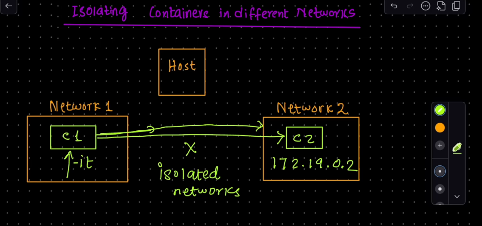
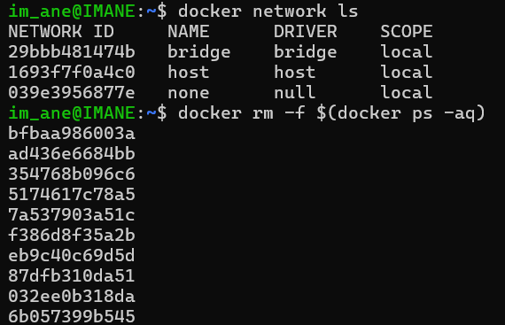
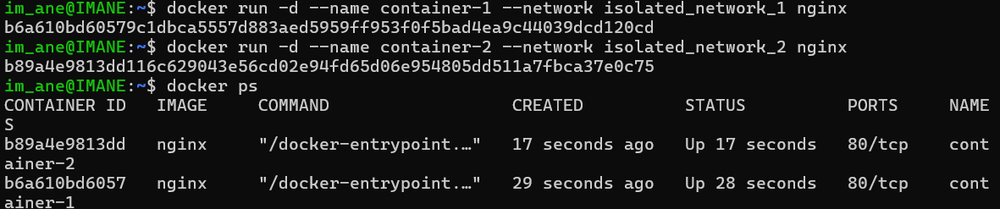
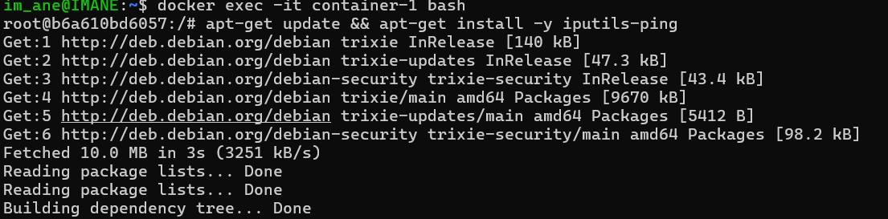
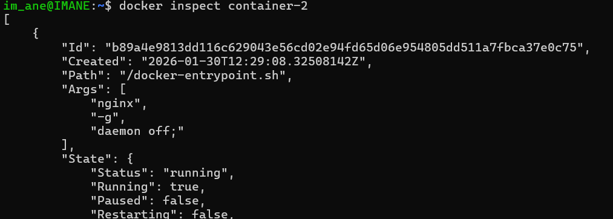
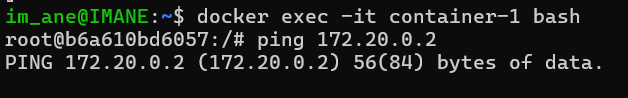

---

# Container Isolation in Docker
* ontainers on different networks are isolated and cannot communicate with each other.
*  Containers on the same network can communicate with each other.
*  Isolated networks enhance security by restricting communication between containers.
---

## **Introduction**
Container isolation is a fundamental concept in Docker that ensures each container runs in its own environment, separate from other containers and the host system. This provides security, stability, and predictability.

---

## **Why Use Container Isolation?**

1. **Security:**
   - Containers run in isolated environments, preventing one container from interfering with another or the host system.
   - Each container has its own filesystem, processes, and network interfaces.

2. **Resource Management:**
   - Isolated containers can be allocated specific resources (CPU, memory, etc.), ensuring no single container can monopolize system resources.

3. **Predictability:**
   - Applications inside containers behave the same way regardless of where they are deployed, reducing the "it works on my machine" problem.

4. **Multi-tenancy:**
   - Multiple applications or services can run on the same host without conflicts.

---

## **Docker Networks and Isolation**

### **Default Networking**
By default, Docker creates a bridge network (`docker0`) where all containers can communicate with each other. However, you can create isolated networks to restrict communication between containers.

---

## **Commands in the Images Explained**

### **Step 1: Remove All Stopped Containers**
```bash
docker rm -f $(docker ps -aq)
```
- **`docker ps -aq`:** Lists all containers (running and stopped) and returns their IDs.
- **`docker rm -f`:** Forcefully removes all the containers listed.

---

### **Step 2: Create Isolated Networks**
```bash
docker network create --driver bridge isolated_network_1
docker network create --driver bridge isolated_network_2
```
- **`docker network create`:** Creates a new Docker network.
- **`--driver bridge`:** Specifies the network driver as bridge (default driver for Docker networks).
- **`isolated_network_1` and `isolated_network_2`:** Names of the new isolated networks.

---

### **Step 3: Run Containers in Isolated Networks**
```bash
docker run -d --name container-1 --network isolated_network_1 nginx
docker run -d --name container-2 --network isolated_network_2 nginx
```
- **`docker run -d`:** Runs a container in detached mode (in the background).
- **`--name container-1` and `--name container-2`:** Names the containers for easy reference.
- **`--network isolated_network_1` and `--network isolated_network_2`:** Attaches each container to its respective isolated network.
- **`nginx`:** The Docker image used to create the containers.

---

## **What Does This Achieve?**

- **`container-1`** is connected to `isolated_network_1`.
- **`container-2`** is connected to `isolated_network_2`.

Since these containers are on different networks, they **cannot** communicate with each other directly. This provides network-level isolation.

---

## **Verification**

### **Step 1: List Running Containers**
```bash
docker ps
```
- This command lists all running containers, their IDs, names, commands, creation times, statuses, and ports.

### **Output Explanation:**
```
CONTAINER ID   IMAGE   COMMAND                  CREATED         STATUS         PORTS   NAMES
3fae3e19391d   nginx   "/docker-entrypoint.…"   43 seconds ago  Up 42 seconds  80/tcp  container-2
24656bdcc73b   nginx   "/docker-entrypoint.…"   55 seconds ago  Up 54 seconds  80/tcp  container-1
```
- **`CONTAINER ID`:** Unique identifier for each container.
- **`IMAGE`:** The Docker image used to create the container (nginx in this case).
- **`COMMAND`:** The command running inside the container.
- **`CREATED`:** How long ago the container was created.
- **`STATUS`:** Current status of the container (Up means it's running).
- **`PORTS`:** Ports exposed by the container (80/tcp for HTTP traffic).
- **`NAMES`:** Names assigned to the containers.

---

### **Step 2: Access a Container**
```bash
docker exec -it container-1 /bin/bash
```
- **`docker exec`:** Runs a command inside a running container.
- **`-it`:** Allocates an interactive terminal session.
- **`/bin/bash`:** Starts a bash shell inside the container.

Once inside the container, you can verify network isolation by trying to communicate with `container-2`. Since they are on different networks, they cannot ping or communicate with each other.

---

## **Testing Isolation**

1. **Access `container-1`:**
   ```bash
   docker exec -it container-1 /bin/bash
   ```

2. **Install `ping` (if needed):**
   ```bash
   apt-get update && apt-get install -y iputils-ping
   ```

3. **Try to Ping `container-2`:**
   - Find the IP address of `container-2`:
   
   - Attempt to ping `container-2` from `container-1`:
  ```bash
     ping <IP_ADDRESS_OF_CONTAINER_2>
     ```
     
   - The ping should fail, confirming that the containers are isolated from each other.

---

## **Conclusion**

- **Isolation Benefits:** Security, resource management, predictability, and multi-tenancy.
- **Network Isolation:** Containers on different networks cannot communicate with each other, providing an additional layer of security and isolation.
- **Commands Used:**
  - `docker rm -f $(docker ps -aq)`: Remove all containers.
  - `docker network create`: Create isolated networks.
  - `docker run --network`: Run containers in specific networks.
  - `docker ps`: List running containers.
  - `docker exec -it`: Access a running container.

---
