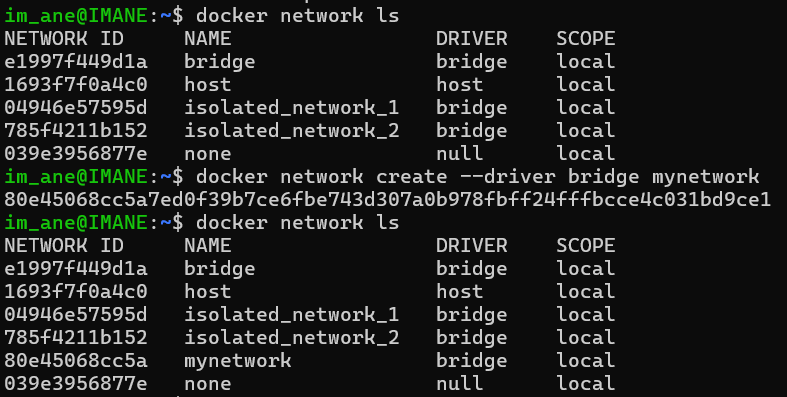
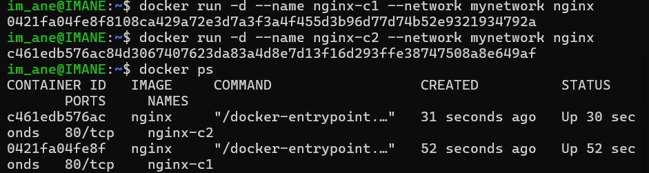
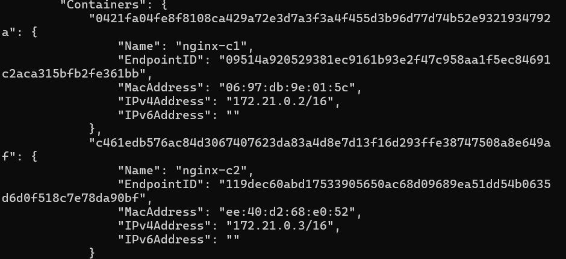
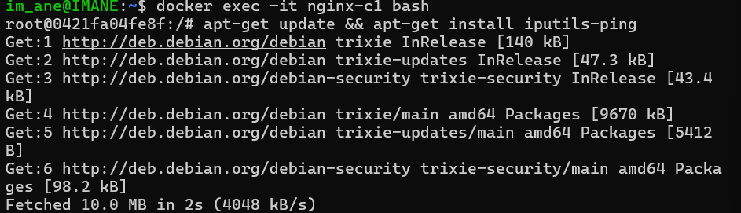
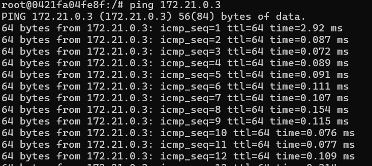

# Custom Docker Network for Container Communication

---

## **Introduction**
In this guide, we'll explore how to create a custom Docker network to facilitate communication between containers. By default, Docker uses a bridge network (`docker0`), but creating a custom network provides better isolation and control over container communication.

---

## **Architecture Overview**
- **Host:** Your machine where Docker is installed.
- **Docker0:** The default bridge network created by Docker.
- **Custom Network:** A user-defined bridge network for better isolation and control.
- **Containers (C1, C2):** Containers connected to the custom network.

In the default setup, all communication between containers and the host passes through the `docker0` bridge. However, with a custom network, communication between containers and the host passes through a new virtual bridge, providing better isolation and control.

---

## **Steps to Create a Custom Docker Network**

### **Step 1: Remove Existing Containers**
To ensure a clean environment, remove any existing containers:
```bash
docker rm -f $(docker ps -aq)
```

---

### **Step 2: Create a Custom Network**
Create a custom bridge network named `my_network`:
```bash
docker network create --driver bridge my_network
```
- **`--driver bridge`:** Specifies that we want a bridge network.
- **`my_network`:** The name of the custom network.

---

### **Step 3: Run Containers in the Custom Network**
Run two containers (`nginx_c1` and `nginx_c2`) in detached mode and attach them to `my_network`:

1. **Run the first container:**
   ```bash
   docker run -d --name nginx_c1 --network my_network nginx
   ```

2. **Run the second container:**
   ```bash
   docker run -d --name nginx_c2 --network my_network nginx
   ```

---

### **Step 4: Verify Network Attachment**
Check if the containers are correctly attached to `my_network`:
```bash
docker network inspect my_network
```
- Look for the "Containers" section in the output to confirm that both `nginx_c1` and `nginx_c2` are listed.



---

### **Step 5: Test Communication Between Containers**

1. **Access `nginx_c1` in Interactive Mode:**
   ```bash
   docker exec -it nginx_c1 /bin/bash
   ```

2. **Install the `ping` Utility:**
   ```bash
   apt-get update && apt-get install -y iputils-ping
   ```


4. **Ping `nginx_c2` from `nginx_c1`:**
   ```bash
   ping <IP_ADDRESS_OF_NGINX_C2>
   ```
   - Replace `<IP_ADDRESS_OF_NGINX_C2>` with the actual IP address of `nginx_c2`.
   - You should see responses from `nginx_c2`, confirming that the containers can communicate through the custom network.

---

## **Why Use a Custom Network?**

- **Isolation:** Containers on different networks are isolated from each other, enhancing security.
- **Control:** Custom networks provide better control over container communication.
- **Performance:** Custom networks can improve performance by reducing network overhead.

---

## **Docker Compose (Next Step)**
While you can manually create networks and run containers, Docker Compose provides a more elegant and automated way to manage multi-container applications. With Docker Compose, you can define networks and services in a YAML file, making it easier to deploy and manage complex applications.

---

## **Summary of Commands:**

| Command                                      | Description                                                                 |
|----------------------------------------------|-----------------------------------------------------------------------------|
| `docker rm -f $(docker ps -aq)`             | Remove all existing containers.                                             |
| `docker network create --driver bridge my_network` | Create a custom bridge network named `my_network`. |
| `docker run -d --name nginx_c1 --network my_network nginx` | Run a container in the custom network. |
| `docker network inspect my_network`         | Inspect the custom network to verify container attachment.               |
| `docker exec -it nginx_c1 /bin/bash`        | Access a running container in interactive mode.                           |
| `apt-get update && apt-get install -y iputils-ping` | Install the `ping` utility inside the container. |
| `docker inspect -f '{{range.NetworkSettings.Networks}}{{.IPAddress}}{{end}}' nginx_c2` | Get the IP address of a container. |
| `ping <IP_ADDRESS_OF_NGINX_C2>`             | Test communication between containers.                                    |

---
