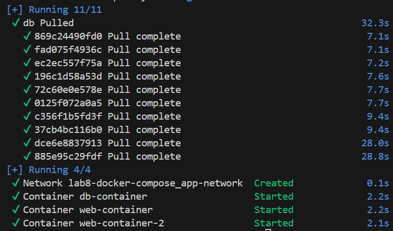
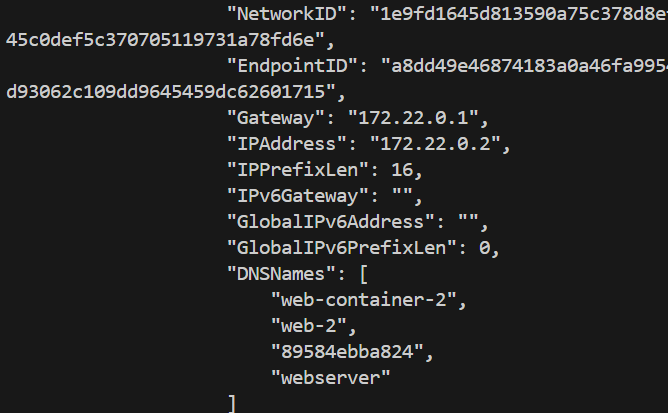
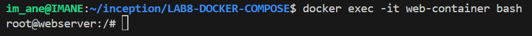
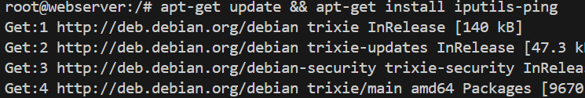
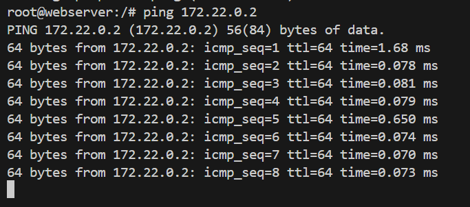
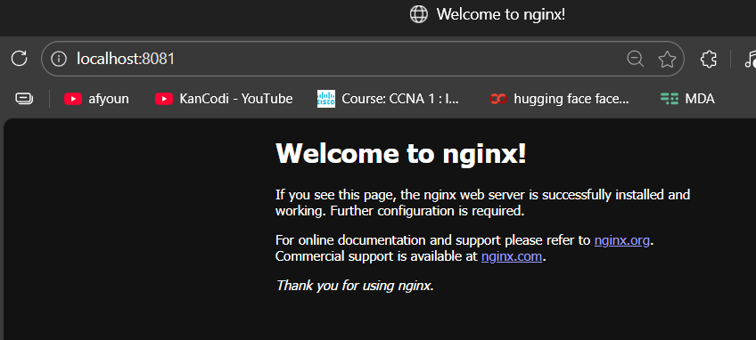
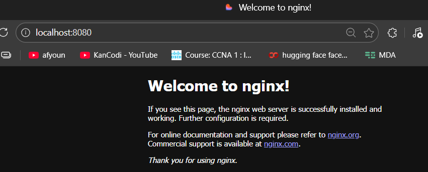

# Docker Compose: Container Communication and Port Forwarding

## **Introduction to Docker Compose**

Docker Compose is a tool that helps you define and manage multi-container Docker applications. Instead of running multiple commands in the terminal, you can define everything in a single YAML file (`docker-compose.yml`). This makes it easier to orchestrate complex setups, manage networks, and handle port forwarding.

---

## **Why Use Docker Compose?**

### **1. Simplified Management**
- **Single Configuration File:** All your services, networks, and configurations are defined in one YAML file.
- **Single Command:** Start, stop, and rebuild services with simple commands.

### **2. Reproducibility**
- **Consistent Environments:** Your application will run the same way every time, ensuring consistency across different environments (development, staging, production).
- **Infrastructure as Code:** Define your infrastructure in a file, making it easy to version control and share with others.

### **3. Isolation and Control**
- **Network Isolation:** Create custom networks for your containers, providing better isolation and control over container communication.
- **Service Scaling:** Easily scale services up or down.

### **4. Ease of Use**
- **Automatic Image Pulling:** Docker Compose automatically pulls images if they are not available locally.
- **Environment Variables:** Define environment variables directly in the YAML file.

---

## **Step-by-Step Guide**

### **Step 1: Start Containers with Docker Compose**
Run the following command to start your containers in detached mode:
```bash
docker compose up -d
```


- **Explanation:** This command reads your `docker-compose.yml` file and starts all services defined in it.
- **Containers:** `web-container` and `web-container-2` are created and attached to the `app-network`.
- **Docker Compose:** Automates the creation of containers, networks, and volumes, ensuring everything is set up correctly.

---

### **Step 2: Verify Container IP Addresses**
To confirm that both containers are on the same network, get the IP address of `web-container-2`:
```bash
docker inspect web-container-2 | grep IPAddress
```


- **Explanation:** The output shows the IP address of `web-container-2` (e.g., `172.22.0.2`).
- **Network:** This IP address is assigned by Docker within the `app-network` subnet.
- **Docker Network:** Each custom network in Docker is a separate subnet, allowing containers to communicate securely.

---

### **Step 3: Open an Interactive Session**
Access a shell inside `web-container` to test connectivity:
```bash
docker exec -it web-container bash
```


- **Explanation:** This command opens an interactive shell inside the `web-container`.
- **Access:** You can now run commands inside the container as if you were logged into a regular Linux machine.

---

### **Step 4: Install `ping` Utility**
Update the package list and install `iputils-ping` to test network connectivity:
```bash
apt-get update && apt-get install -y iputils-ping
```


- **Explanation:** The `ping` utility is used to test network connectivity between containers.
- **Update and Install:** These commands update the package list and install the `ping` utility.

---

### **Step 5: Test Network Connectivity**
Ping `web-container-2` from inside `web-container`:
```bash
ping 172.22.0.2
```


- **Explanation:** If you see responses, it confirms that both containers are on the same network (`app-network`) and can communicate with each other.
- **Network Communication:** Containers on the same custom network can communicate directly using their IP addresses or container names.

---

### **Why This Works:**
- **Custom Network (`app-network`):** Docker Compose creates a dedicated bridge network for your containers, isolating them from other networks and allowing them to communicate directly.
- **Container Communication:** Containers on the same custom network can communicate using their IP addresses or container names (e.g., `ping web-container-2`).

---

### **Step 6: Test Port Forwarding**
Docker Compose maps container ports to host ports, allowing you to access services from your browser:

1. Open `http://localhost:8080/` to access the Nginx server in `web-container`.
   

2. Open `http://localhost:8081/` to access the Nginx server in `web-container-2`.
   

- **Port Mapping:**
  - `8080:80` maps port 80 in `web-container` to port 8080 on your host machine.
  - `8081:80` maps port 80 in `web-container-2` to port 8081 on your host machine.
- **Accessibility:** Port forwarding allows you to access containerized services from your host machine, making it easy to test and interact with your applications.

---

## **Detailed Explanation of Docker Compose File**

Here is an example of a `docker-compose.yml` file:

```yaml
version: '3.8'

services:
  web:
    image: nginx:latest
    container_name: web-container
    ports:
      - "8080:80"
    networks:
      - app-network

  web-2:
    image: nginx:latest
    container_name: web-container-2
    ports:
      - "8081:80"
    networks:
      - app-network

  db:
    image: mysql:8
    container_name: db-container
    hostname: database
    environment:
      MYSQL_ROOT_PASSWORD: mypassword
    networks:
      - app-network

networks:
  app-network:
    driver: bridge
```

### **Explanation:**

- **`version: '3.8'`:** Specifies the version of the Docker Compose file format.

- **`services:`:** Defines the containers you want to run.
  - **`web:`:** A service named "web".
    - **`image: nginx:latest`:** Uses the latest Nginx image.
    - **`container_name: web-container`:** Names the container `web-container`.
    - **`ports: - "8080:80"`:** Maps port 8080 on your host to port 80 in the container.
    - **`networks: - app-network`:** Attaches the container to the `app-network`.

  - **`web-2:`:** A service named "web-2".
    - Similar configuration to the `web` service, but maps port 8081 on your host to port 80 in the container.

  - **`db:`:** A service named "db".
    - **`image: mysql:8`:** Uses the MySQL 8 image.
    - **`container_name: db-container`:** Names the container `db-container`.
    - **`environment:`:** Sets environment variables for the MySQL container.
    - **`networks: - app-network`:** Attaches the container to the `app-network`.

- **`networks:`:** Defines the custom networks you want to create.
  - **`app-network:`:** A network named `app-network`.
    - **`driver: bridge`:** Uses the bridge driver for the network.

---

## **Key Takeaways:**

- **Docker Compose** automates the process of creating and managing multi-container applications.
- **Custom Networks** ensure containers can communicate securely and efficiently.
- **Port Forwarding** allows you to access containerized services from your host machine.
- **Infrastructure as Code** makes it easy to version control and share your configurations.

---
